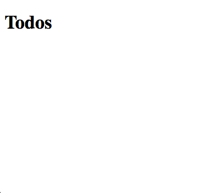

# Aurelia for new developers

## The App class <a href="#download-a-code-editor" id="download-a-code-editor"></a>

Aurelia stands out from other frameworks and libraries by allowing you to model your entire application using plain Javascript. It's one of those things that's best understood through experience, so let's dive in.

We'll start by replacing the App class that comes with the skeleton you created in the [Quick Start](quick-start.md) section.

Picture this: our todo application is essentially a list of tasks. Users can add new todos by typing a description and removing them. Once a todo is added, the input field clears automatically and is ready for the next entry. Simple, right?

Let's take these concepts and turn them into code. Aurelia's approach makes this process intuitive and straightforward.



```javascript
export class App {
  constructor() {
    this.heading = 'Todos';
    this.todos = [];
    this.todoDescription = '';
  }
  
  addTodo() {
    if (this.todoDescription) {
      this.todos.push({
        description: this.todoDescription,
        done: false
      });
      this.todoDescription = '';
    }
  }
  
  removeTodo(todo) {
    const index = this.todos.indexOf(todo);
    if (index !== -1) {
      this.todos.splice(index, 1);
    }
  }
}
```



```typescript
interface ITodo {
  description: string;
  done: boolean;
}
  
export class App {
  heading: string;
  todos: ITodo[];
  todoDescription: string;

  constructor() {
    this.heading = 'Todos';
    this.todos = [];
    this.todoDescription = '';
  }

  addTodo(): void {
    if (this.todoDescription) {
      this.todos.push({
        description: this.todoDescription,
        done: false
      });
      this.todoDescription = '';
    }
  }

  removeTodo(todo: ITodo): void {
    const index = this.todos.indexOf(todo);
    if (index !== -1) {
      this.todos.splice(index, 1);
    }
  }
}
```



Let's review the ideas we modelled:

* Our application has a `heading` of "Todos".
* The todo list is modelled as an array of todo instances represented by the `todos` property.
* Todo instances can be added (`addTodo`) or removed (`removeTodo`).
* When a new todo is added, it is given a description, and the done flag defaults to false.
* After adding a new todo, the `todoDescription` is cleared to enable the next addition.

Here's what's amazing. This is all the code for the app. But where is Aurelia? Well, the answer is that Aurelia tries as hard as possible to stay out of your code. That's why you don't see it above. It's not needed. Aurelia can render plain objects.

## Rendering the app

Let's recap what we've covered so far. You might be surprised to learn that most of our work isn't Aurelia-specific. The bulk of our code is just plain vanilla Javascript/TypeScript.

We've got our src/main.ts file, which serves as the entry point for our app. By convention, it typically uses src/app.ts as the root UI component. To dive deeper into this, check out our docs' App Configuration and Startup section.

Now, let's talk about rendering. To bring our app component to life, we need to create a view for it. This is where we introduce another Aurelia convention. Creating a view for any class is straightforward: create an HTML file with the same name as your TypeScript module, but swap out the file extension for .html.

Inside this view, you can set up an HTML template. This is where the magic happens - you can use data-binding expressions to specify how the view should render an instance of your class.

Let's start simple. We're going to create a basic view for our app. Open up the `src/app.html` file the skeleton provided, and we'll overwrite it with our code.


```html
<template>
    <h1>${heading}</h1>
</template>
```


There are a couple of things to notice here. First, all views are wrapped in an `template` element. Second, did you notice the `${heading}` syntax? Well, inside a view, you have access to all the properties and methods of the class instance associated with that View, and you can access them inside the content of any element or attribute by using the TypeScript template string syntax as shown above. The above syntax creates a one-way data-binding to the `heading` property. By "one-way", we mean that the dataflow is unidirectional, and only changes to the `heading` property will affect the view. There is no "reverse" flow from the view back to the view-model.


We call a View's associated class its _View-Model_ because it's a model for or a model of the View. Most Aurelia development leverages the Model—View—View-Model pattern. However, Aurelia is flexible enough to use patterns like Supervising Controller, Passive View, and Model—View—Controller if desired.


Run `au run --open` if you haven't done that. When you run the app, you should see the app render out the `heading` property, something like this:

<figure><figcaption></figcaption></figure>

Rendering properties in HTML seems simple enough, but what about working with user input? Let's add some markup that enables us to take input from the user to create our todos:


```html
<template>
  <h1>${heading}</h1>

  <form submit.trigger="addTodo()">
    <input type="text" value.bind="todoDescription">
    <button type="submit" disabled.bind="!todoDescription">Add Todo</button>
  </form>
</template>
```


Let's look at the form we've just added to our view. This form is designed to gather the todo name from the user. Notice the input element – we've used the `.bind` syntax on its value attribute. This is Aurelia's way of creating a connection between the input's value and the `todoDescription` property in our view-model. It's a neat trick that allows you to bind any HTML attribute to your view model using a simple property expression.

It's worth pointing out a clever convention Aurelia uses here. When you use `.bind`, Aurelia automatically chooses the most appropriate "binding mode" based on the element and attribute you're working with. In this case, Aurelia sets up a two-way binding since we're dealing with an input's value. Any changes to `todoDescription` in the view-model will update the input's value, and vice versa.

You'll also spot another binding: `disabled.bind="!todoDescription"`. This one-way binding disables the button when `todoDescription` is empty. Unlike the input's value, there's no need for user input to sync back here, hence the one-way nature.

But wait, there's more. Aurelia doesn't just let you bind properties – you can also hook into events. Check out the form element. By appending `.trigger` to any DOM event, you're telling Aurelia to evaluate the associated expression when that event fires. In our case, the submit event triggers the `addTodo()` method. This setup means users can add a todo by clicking the submit button or pressing enter while focused on the input. It's pretty handy, right?


Aurelia will use two-way binding for all form control value bindings and one-way binding for everything else. However, you can always override this by using an explicit binding command. For example, instead of using `.bind` you can use `.one-way`, `.two-way` or `.one-time`. Similarly, you can use `.delegate` for event delegation in place of `.trigger`.


If you run the app now, you should see something like this:

<figure><figcaption></figcaption></figure>

Try typing into the input box and adding the todo. You should notice that the input box gets cleared out each time you do that. The reason for this is that the `value` of the `input` has two-way binding, and our original code cleared out the `todoDescription` after adding a new todo instance. Here's our `addTodo()` implementation for reference:



```javascript
addTodo() {
  if (this.todoDescription) {
    this.todos.push({
      description: this.todoDescription,
      done: false
    });
    this.todoDescription = '';
  }
}
```



```typescript
addTodo() {
  if (this.todoDescription) {
    this.todos.push({
      description: this.todoDescription,
      done: false
    });
    this.todoDescription = '';
  }
}
```



We can now add todos, but we can't see them. Let's remedy that by looking at how Aurelia handles lists of data. Change your markup to match this new version:

```html
<template>
  <h1>${heading}</h1>

  <form submit.trigger="addTodo()">
    <input type="text" value.bind="todoDescription">
    <button type="submit" disabled.bind="!todoDescription">Add Todo</button>
  </form>

  <ul>
    <li repeat.for="todo of todos">
      <input type="checkbox" checked.bind="todo.done">
      <span>
        ${todo.description}
      </span>
      <button click.trigger="removeTodo(todo)">Remove</button>
    </li>
  </ul>
</template>
```

When working with Arrays, Maps, or Sets in Aurelia, we use the `repeat.for="local of collection"` syntax to generate HTML. This syntax is inspired by Javascript's for...of loop, making it intuitive for developers familiar with the language.

Let's break down the example above. We want to create an `li` element for each item in our `todos` array. To achieve this, we add a `repeat.for` attribute to the `li` element we want to replicate. We specify the `todos` collection and choose a name for our local loop variable – in this case, `todo`.

With this setup, we can easily bind to any property of the `todo` instance. We're applying the same techniques we discussed earlier: binding the `checked` attribute to the todo's `done` property and injecting the `description` property into the `span`'s content.

We've also added a click event trigger on the button to remove the todo. You'll notice that `removeTodo` is still in scope. Like in Javascript, variables from the outer block remain accessible inside a loop. This allows us to call the `removeTodo` method on the App class, passing in the specific todo instance we want to remove.

This approach gives us a powerful and flexible way to generate dynamic content based on our data collections while maintaining clean and readable code.

If you run the application again, you should now see something like this:

<figure><figcaption></figcaption></figure>

We're on the home stretch now, but we've overlooked one small detail. You might have noticed that checking and unchecking the boxes does not provide visual feedback. That's not ideal for user experience, is it?

How about we add a little flair by crossing out the todo item when it's checked? This way, users can easily see which tasks they've completed. Let's make one last tweak to our view to incorporate this feature:

```html
<template>
  <h1>${heading}</h1>

  <form submit.trigger="addTodo()">
    <input type="text" value.bind="todoDescription">
    <button type="submit" disabled.bind="!todoDescription">Add Todo</button>
  </form>

  <ul>
    <li repeat.for="todo of todos">
      <input type="checkbox" checked.bind="todo.done">
      <span css="text-decoration: ${todo.done ? 'line-through' : 'none'}">
        ${todo.description}
      </span>
      <button click.trigger="removeTodo(todo)">Remove</button>
    </li>
  </ul>
</template>
```

This example demonstrates direct CSS binding on HTML elements, showcasing the versatility of Aurelia's `${}` syntax within attributes. We apply a line-through text decoration when a todo item is marked as done, otherwise leaving it undecorated. This simple technique allows for dynamic styling based on your data's state.

Run the application one more time and you should see the expected result:

<figure><figcaption></figcaption></figure>

Aurelia prioritizes developer experience, making application creation both powerful and enjoyable. Our simple conventions minimize configuration and boilerplate code, freeing you from framework constraints. Aurelia's pluggable and customizable design ensures flexibility, while its seamless integration lets you focus on writing plain Javascript and TypeScript without constant framework awareness.

We encourage you to explore our Contact Manager Tutorial next. It demonstrates how to set up a production-grade project using the Aurelia CLI and introduces advanced features like routing, publish/subscribe, and custom elements.

We're looking forward to seeing what you create!
